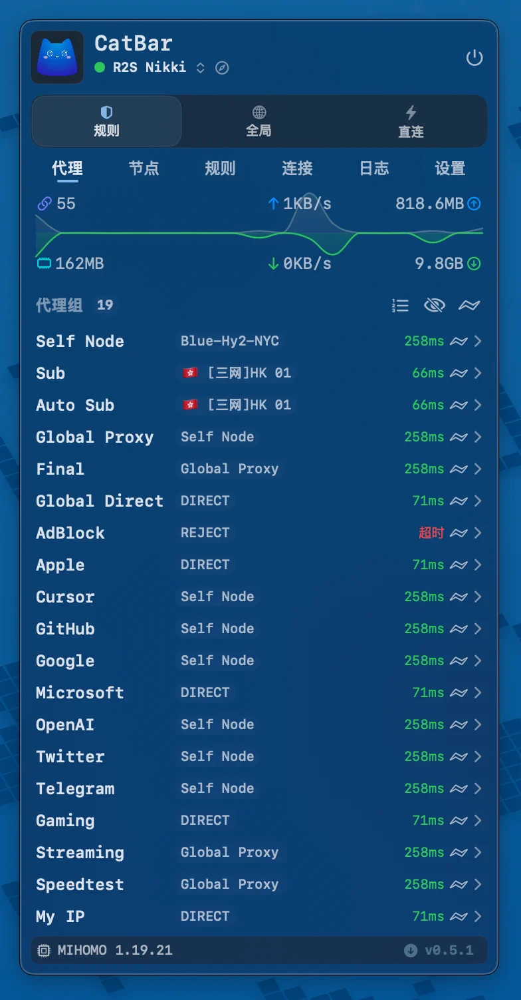

# CatBar

基于 `SwiftUI + AppKit` 构建的原生 macOS 菜单栏代理面板，专注轻量、稳定与可观测。

  
  
  
  
  

  

---

## 项目说明

本仓库 fork 自原仓库 [Sitoi/ClashBar](https://github.com/Sitoi/ClashBar)，并在此基础上继续进行二次开发与定制维护。

## 发布说明

本仓库当前只发布 `no-core` 版本，不内置任何 Clash / mihomo 核心二进制，只提供应用面板与相关管理功能。

如需实际启用内核能力，请自行准备兼容的 `mihomo` 可执行文件，并放入：

`~/Library/Application Support/catbar/core/`

应用会从该目录读取本地核心。

## 贡献者

感谢所有参与贡献的开发者：

## 致谢

- 特别感谢原作者 [Sitoi](https://github.com/Sitoi) 及其开源的 [Sitoi/ClashBar](https://github.com/Sitoi/ClashBar) 仓库，为本仓库奠定了坚实的基础。
- 也特别感谢 [MetaCubeX/mihomo](https://github.com/MetaCubeX/mihomo) 提供稳定可靠的 Core 能力。

## Star 趋势

## 许可证

本项目采用 `GPL-3.0` 许可证，详见 [LICENSE](LICENSE)。